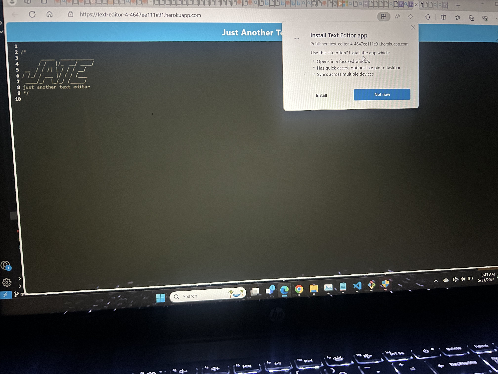

# PWA-challenge

## Table of Contents

- [Description](#description)

- [Live-URL](#live-url)

- [Screenshots](#screenshots)

- [Technologies-Used](#technologies-used)

- [Installation](#installation)

- [Features](#features)

- [License](#license)

- [Questions](#questions)

## Description

This application was specifically developed to enhance skills in progressive web application development. The goal was to understand a deeper level of the inner workings of the React JavaScript library. The application focuses on four key areas:
* 		Configuration: Setting up the webpack.config.js file with essential workbox plugins for service worker and manifest files, along with CSS and babel loader for compatibility with older code.
* 		Offline functionality: Implementing asset caching in the src-sw.js file to enable the application to work offline.
* 		Database integration: Configuring the database to facilitate data management, including addition, updating, and retrieval from the IndexedDB.
* 		User-friendly installation: Adding event handlers to the install button for easy installation on personal application stacks and offline usage.

## Live URL

https://text-editor-4-4647ee111e91.herokuapp.com/

## Screenshots

 

## Technologies Used

This application is powered by Webpack (HTML-Webpack-Plugin, Babel, and CSS Loader), Node.js, Express.js and JavaScript. Nodemon and Concurrently  were utilized as a devDependencies allowing the server to refresh when edits were made to application, and allowing both the front end and back end to be ran on a single command (npm run start:dev).

## Installation

Users can view and utilize the application through the use of the browser by visiting the deployed application at https://text-editor-4-4647ee111e91.herokuapp.com/
Viewing the application in the browser will also give users the ability to download the application allowing it to be used offline.

To make any further additions, start by cloning the repo in the command line git clone git@github.com:Watsonaj0316/PWA-challenge.git, or forking the repo.

## Features

Once the application is opened, the IndexedDB will persist any notes added to the site. There is no need to save any information as the application automatically updates the IndexedDB -> The only thing required for this feature to occur is that the user clicks out of the window. When returning to the site, they will find all of their notes and other information persisted to the page.

## Usage Information

Visit the live URL https://text-editor-4-4647ee111e91.herokuapp.com/ and start adding notes right away! Users will also notice an install button in the nav bar allowing for the application to be downloaded and used offline. Saving of notes occurs automatically through the IndexedDB; the only thing required is for the user to click out of the window and notes will be persisted whether using the application online or offline.

## License

NOTICE: This application is covered under the ISC License

## Questions

Need more information? You can contact me through my Email. 
[watsonalyece33@gmail.com]